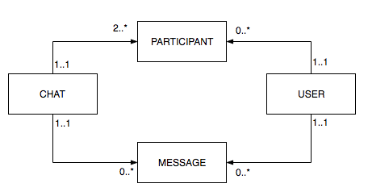

Chat documentation
======

The chat solution uses Action Cable, for more information please visit: [ActionCable Doc](http://edgeguides.rubyonrails.org/action_cable_overview.html), and to know how to write tests for your solution refer to [ActionCableTesting Gem](https://github.com/palkan/action-cable-testing)

### Chat model diagram

First you need to register users as participants of a chat, then you can start chatting. The purpose of the participant model is to not only store which user is in each chat, but also store chat common data like "last_message", "last_connection" so queries are on a lightweight table (compared to messages, which is the usual approach).

### Chat flow

